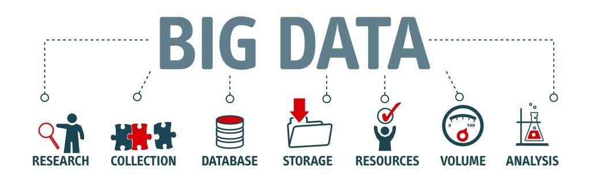

# Hadoop Basics

## Terminologies and commands that are often used in the world of Bigdata

** _Note: Refer the links metioned below for detailed explanation_ **

- Difference between Bigdata and Hadoop

:link: [Bigdata and Hadoop](https://medium.com/@jayvardhan.reddy.v/bigdata-part-1-770ad8f1c6ea)

- Common terminologies and jargons that are commonly used in the space of Bigdata

:link: [Bigdata and Hadoop Terminologies](https://medium.com/@jayvardhan.reddy.v/big-data-part2-basic-terminologies-1e5be8d254a9)

- Hadoop Architecture 1.0

:link: [Hadoop 1.0 Architecture](https://medium.com/@jayvardhan.reddy.v/bigdata-part3-hadoop-1-0-architecture-763f51a0f5f) 
